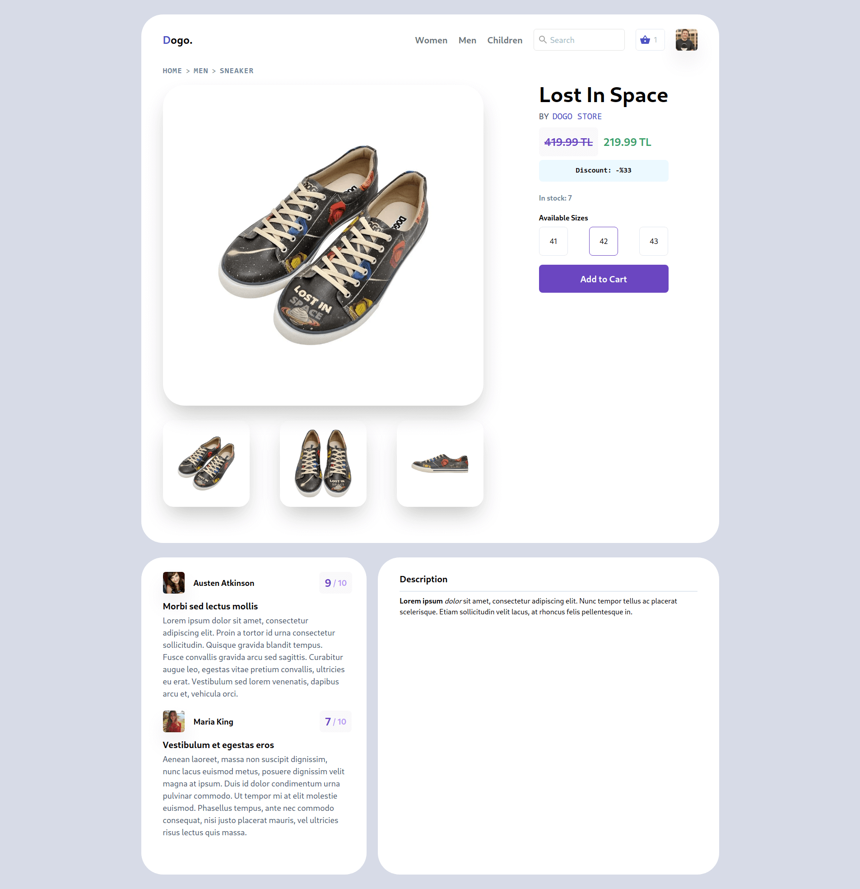
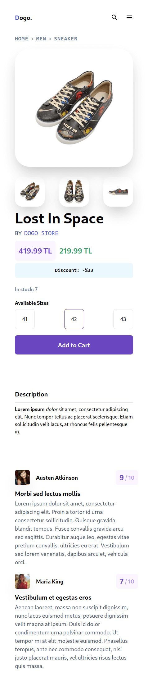

# Product Detail Page

This is a design that I have found on Dribble. I wrote it with my own twist in some areas.  
Original Design: [Product Page by Vishnu Prasad](https://dribbble.com/shots/14127375-Product-Page)

Desktop Screenshot

Mobile Screenshot

### [See live demo](https://iakindev.github.io/product-detail-page/)

### Instructions

- Run `yarn` to install dependencies
- Run `yarn start` to start development server
- Run `yarn build` if you want to build it and pack it up
